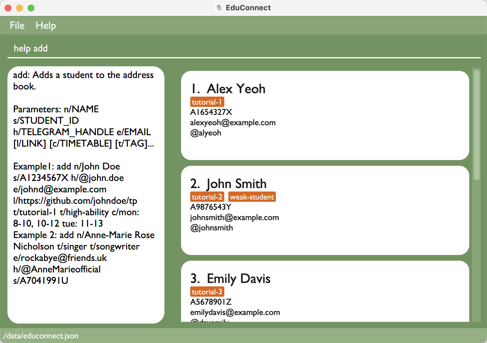
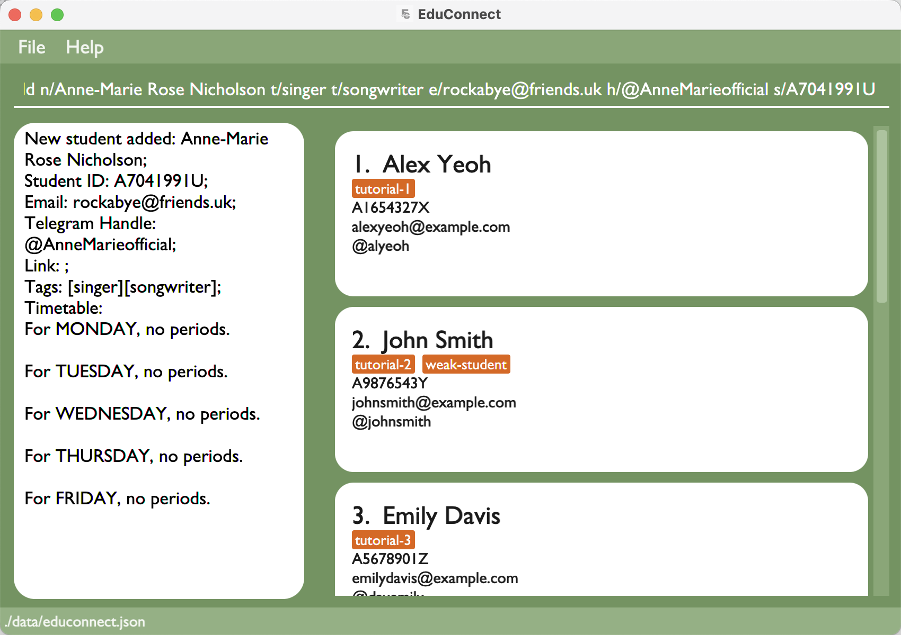
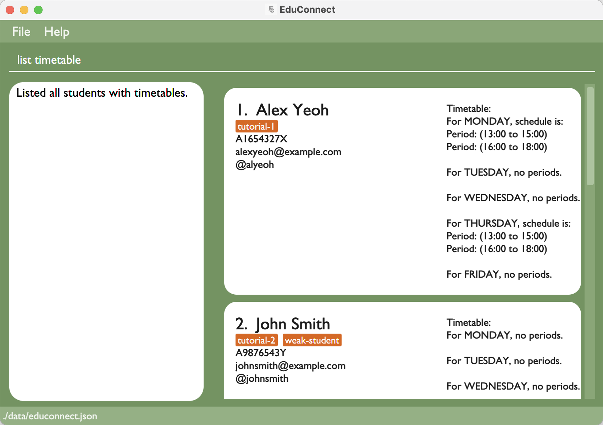
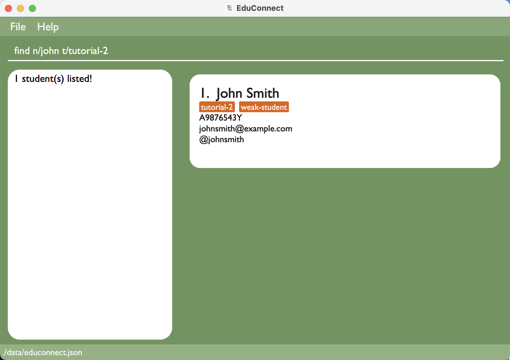
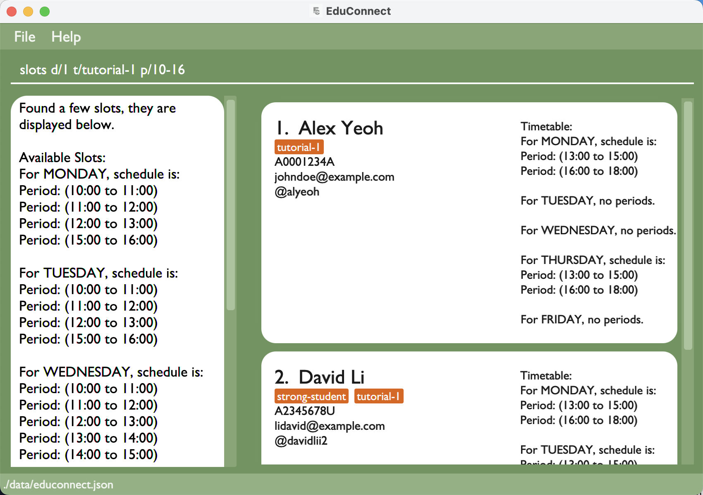
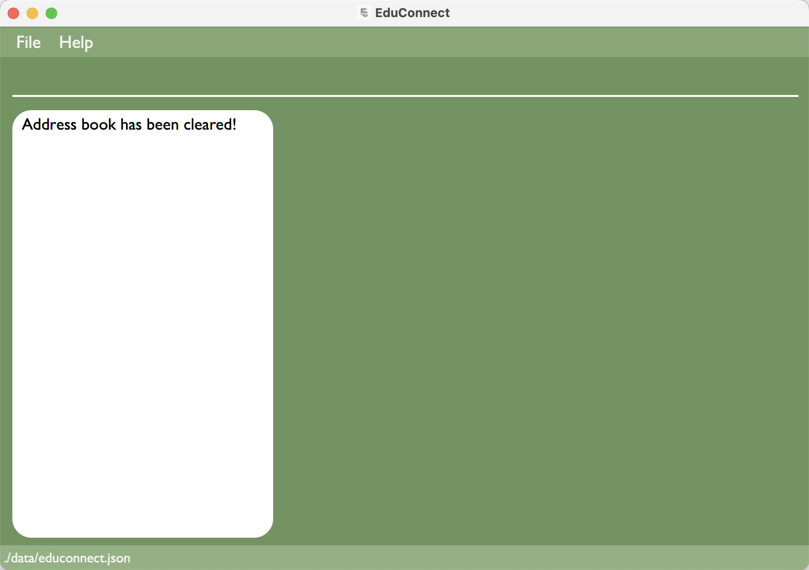

# EduConnect User Guide

EduConnect is a **desktop app for managing student contacts, optimized for use via a Command Line Interface (CLI)** while still having the benefits of a Graphical User Interface (GUI). If you can type fast, EduConnect can get your contact management tasks done faster than traditional GUI apps.

<!-- * Table of Contents -->
- [EduConnect User Guide](#educonnect-user-guide)
  - [Quick start](#quick-start)
  - [Features](#features)
    - [Viewing help: `help`](#viewing-help-help)
    - [Adding a student: `add`](#adding-a-student-add)
    - [Listing all students: `list`](#listing-all-students-list)
    - [Editing a student: `edit`](#editing-a-student-edit)
    - [Locating students by name: `find`](#locating-students-by-name-find)
    - [Copying student emails: `copy`](#copying-student-emails-copy)
    - [Deleting a student: `delete`](#deleting-a-student-delete)
    - [Finding a common available time slot among students: `slots`](#finding-a-common-available-time-slot-among-students-slots)
    - [Clearing all students: `clear`](#clearing-all-students-clear)
    - [Exiting EduConnect: `exit`](#exiting-educonnect-exit)
    - [Saving the data](#saving-the-data)
    - [Editing the data file](#editing-the-data-file)
  - [FAQ](#faq)
  - [Known issues](#known-issues)
  - [Command summary](#command-summary)

--------------------------------------------------------------------------------------------------------------------

## Quick start

1. Ensure you have Java `11` or above installed in your Computer.

1. Download the latest `educonnect-1.4.jar` from [here](https://github.com/AY2324S2-CS2103-T14-1/tp/releases).

1. Copy the file to the folder you want to use as the _home folder_ for EduConnect.

1. Open a command terminal, `cd` into the folder you put the jar file in, and use the `java -jar educonnect-1.4.jar` command to run the application. 

   A GUI similar to the below should appear in a few seconds.  
   

1. Type the command in the command box and press Enter to execute it. e.g. typing **`help`** and pressing Enter will open the help window. 
   Some example commands you can try:

   * `list` : Lists all students.

   * `add n/John Doe s/A1234567X h/@john_doe e/johnd@example.com t/tutorial-1 t/high-ability` : Adds a contact named `John Doe` to the Address Book.

   * `delete s/A0001234A` : Deletes the person with the `s/STUDENT_ID` unique identifier

   * `clear` : Deletes all contacts.

   * `exit` : Exits the app.

1. Refer to the [Features](#features) below for details of each command.

--------------------------------------------------------------------------------------------------------------------

## Features

<box type="info" seamless>

**Notes about the command format:** 

* Words in `UPPER_CASE` are the parameters to be supplied by the user. 
  e.g. in `add n/NAME`, `NAME` is a parameter which can be used as `add n/John Doe`.

* Items in square brackets are optional. 
  e.g. `n/NAME [t/TAG]` can be used as `n/John Doe t/tutorial-1` or as `n/John Doe`.

* Items with `…`​ after them can be used multiple times including zero times. 
  e.g. `[t/TAG]…​` can be used as ` ` (i.e. 0 times), `t/tutorial-1`, `t/tutorial-1 t/strong` etc.

* Angular brackets `<CONDITION>` will inform the user of the optional prefix requirements that is used in the command  
  e.g `<choose 1 only>` `[s/STUDENT_ID]` `[e/EMAIL]` `[h/TELEGRAM_HANDLE]` indicates that only one of these optional prefix must be present in the command

* Parameters can be in any order. 
  e.g. if the command specifies `n/NAME s/STUDENT_ID`, `s/STUDENT_ID n/NAME` is also acceptable.

* Extraneous parameters for commands that do not take in parameters (i.e. `exit` and `clear`) will be ignored. 
  e.g. if the command specifies `clear 123`, it will be interpreted as `clear`.

* If you are using a PDF version of this document, be careful when copying and pasting commands that span multiple lines as space characters surrounding line-breaks may be omitted when copied over to the application.
</box>

<box type="info" seamless>

**Notes about unique identifiers:** 

* Unique identifiers are `EMAIL`, `STUDENT_ID` and `TELEGRAM_HANDLE`

* There can only be one unique identifier at each time. Which means no two students can share the same unique identifiers above.
</box>

<box type="info" seamless>

**Notes about timetable, days and periods:** 

* Student's timetables are used for tracking student's unavailable periods. 
  e.g For MONDAY, schedule is: Period (13:00 to 1500) it means that the student is unavailable on monday 1pm to 3pm.

* Commands that involve `DAYS` and `PERIODS` are `add`, `edit` and `slot` (go to individual commands to see how they are used).

* `PERIOD` are timings in the day numbered from (0-23), which represents the 24-hour clock. 
  e.g `1-10` or `10-16`

* `DAYS` and only their corresponding three lettered **uncapitalised** prefixes are accepted (Weekends are not used).
  * Monday: `mon`
  * Tuesday: `tue`
  * Wednesday: `wed`
  * Thursday: `thu`
  * Friday: `fri`

* A valid `TIMETABLE` format is written with the three lettered day prefixes followed by a colon and the periods. Separate multiple periods in a day with a comma. 
  e.g `mon: 8-10, 10-12 tue: 8-10 thu: 12-14 fri 16-18, 18-20`

* `add` and `edit` commands allow for adding multiple `PERIOD` while `slot` command does not (go to individual commands for more information). 
  e.g `mon: 8-12, 14-16`

* An overlapping `PERIOD` means that multiple `PERIOD` are added for the same day and there is a timing conflict. 
  e.g `wed: 10-12, 11-13` (11-12 is the overlapping period)

</box>

<box type="info" seamless>

**Additional notes about other parameters:** 

* `NAME` allows for dashes numbers and spaces. However, there cannot be 2 consecutive dashes, spaces or a combination of both. 
  e.g `John Doe`, `Anne-Marie`, `William-The 3rd`
* `TELEGRAM_HANDLE` should start with `@`, consists of only alphanumeric characters and underscores`_`, have a minimum of 5 characters, and have a minimum of 3 alphanumeric characters.
* `EMAIL` should be of the format `local-part@domain`, and adhere to the following constraints:
  * The local-part should only contain alphanumeric characters and these special characters, excluding the parentheses, (+_.-). The local-part may not start or end with any special characters.
  * This is followed by a '@' and then a domain name. The domain name is made up of domain labels separated by periods.
  * The domain name must:
    - end with a domain label at least 2 characters long
    - have each domain label start and end with alphanumeric characters
    - have each domain label consist of alphanumeric characters, separated only by hyphens, if any.
* `TAG` must start with an alphanumeric character, should only contain alphanumeric characters, spaces and hyphens, and it should not be blank.
* `WEBLINK` is used for attaching a student's project in Educonnect. The parameter currently accepts any valid website (HTTP or HTTPS) or file transfer protocol (FTP) links, regardless if it is a broken link. If no protocol (`https://` or `ftp://`) is supplied, the link will default `https://`. 
  e.g `https://github.com/johndoe/tp`

</box>

<box type="info" seamless>

**Notes about displaying timetables of students:** 

* By default, timetables of students are not shown.

* To show or hide timetables of students, use `list` command.

</box>

### Viewing help: `help`

Shows a message explaining how to access the help page. This feature ensures that users can easily understand the functionality and syntax of commands without referring to external documentation.

Format: `help [COMMAND]`

**Notes about valid commands:** 

* Valid commands are: `add`, `list`, `edit`, `find`, `copy`, `delete`, `slots`, `clear`.
* Other commands will not be accepted and will lead to a parse error.  
* If no command is given, a pop-up window showing a brief outline of the commands and a link to the user guide will be given
  

  Examples:
* `help add`

### Adding a student: `add`

Adds a student.

Format: `add n/NAME s/STUDENT_ID e/EMAIL h/TELEGRAM_HANDLE [l/WEBLINK] [c/TIMETABLE] [t/TAG]…​`

<box type="tip" seamless>

**Tip:** A student can have any number of tags (including 0).

**Tip:** A student can have its project page linked to its contact.

**Tip:** A student can have its timetable field left empty, a default empty timetable will be allocated.
</box>

Examples:

* `add n/John Doe s/A1234567X h/@john_doe e/johnd@example.com t/tutorial-1 t/high-ability c/mon: 8-10, 10-12 tue:
  11-13 thu: 12-15, 15-17`

* `add n/Anne-Marie Rose Nicholson t/singer t/songwriter e/rockabye@friends.uk h/@AnneMarieofficial s/A7041991U`
  

### Listing all students: `list`

Shows a list of all students with the option to show timetables.

Format: `list [timetable]`

<box type="tip" seamless>

**Tip:** The choice of show timetables option will be saved and timetables will remain visible/invisible for subsequent command results. However, the choice will be restored to hiding timetable each time application is relaunched.

</box>

Examples:
* `list`
* `list timetable`

### Editing a student: `edit`

Edits an existing student.

Format: `edit <choose only 1> [i:INDEX] [s:STUDENT_ID] [e:EMAIL] [h:TELEGRAM_HANDLE] <choose 1 or more> [n/NAME] [s/STUDENT_ID] [e/EMAIL] [h/TELEGRAM_HANDLE] [l/WEBLINK] [c/TIMETABLE] [t/TAG]…​`

* Edits the student based on the unique identifier of the student.
* Only one of the identifiers should be provided.
* The index `i:INDEX` refers to the index number shown in the displayed student list. The index **must be a positive integer** 1, 2, 3, …​
* At least one of the optional fields must be provided.
* Existing values will be updated to the input values.
* When editing tags, the existing tags of the student will be removed i.e. adding of tags is not cumulative.
* When editing unique identifiers, EduConnect will throw an error if another unique identifier is found in the address
* You can remove all the student’s tags by typing `t/` without
    specifying any tags after it.
* You can reset the timetable to be empty by typing `c/` without specifying anything after it.

Examples:
*  `edit i:1 s/A0001234A e/johndoe@example.com` Edits the student id and email address of the 1st student to be `A0001234A` and `johndoe@example.com` respectively.
  
*  `edit s:A1234567X n/Betsy Crower t/` Edits the name of the student with a student ID of `A1234567X` to be `Betsy Crower` and clears all existing tags.
*  `edit e:christian@nus.com h/@christan c/` Edits the telegram handle and clears the timetable of the student with an email of `christian@nus.com`.
*  `edit h:@christan c/mon: 8-10, 10-12 tue: 11-13 thu: 12-15, 15-17` Replaces the timetable of the student with a telegram handle of `@christan` with this new one according to
   the specifications in the command
*  `edit i:2 l/https://github.com/annemarie/tp` Edits the weblink of the 2nd student to be `https://github.com/annemarie/tp`.

### Locating students by name: `find`

Finds students whose criteria match all the given keywords.

Format: `find <choose 1 or more> [n/NAME] [s/STUDENT_ID] [h/TELEGRAM_HANDLE] [t/TAG]…`

* The search is case-insensitive. e.g. `find n/hans` will match Hans.
* The order of the keywords do not matter. e.g. `find n/hans t/tutorial-1` will return the same result as `find
  t/tutorial-1 n/hans`.
* Name and other criteria are searched using fuzzy matching.
  * Students with any part of the names matching the keyword will be returned.
* Tag is searched as complete tag names. e.g. `find t/tutorial-1` will only return those with a tag 'tutorial-1'
(tag 'tutorial-10', 'tutorial-11', etc. will NOT appear in the results).
  * This is different from the fuzzy matching used in name and other criteria.
* When multiple criteria are used, searched students must match **ALL** criteria specified (Fuzzy matching for non-tags full matching for tags).

Examples:
* `find n/John` returns john and John Doe
* `find e/yahoo` returns Alex Yeoh and David Li (both uses yahoo email)
* `find h/john` returns John Doe and John Lee (telegram handle @johnd and @johnlee respectively)
* `find t/tutorial-1 t/high-ability` returns Samantha (is tagged with BOTH tutorial-1 and high-ability)
* `find n/john t/tutorial-2` returns John Doe (name contains john and is tagged with tutorial-1)
   
  

### Copying student emails: `copy`

Copy student emails to the clipboard.

Format: `copy [t/TAG]…`

* When no tags are supplied, copies all student emails.
* When multiple tags are used, copies emails of all students that has **ALL** the tags specified.
* Tag is searched as complete tag names. e.g. `copy t/tutorial-1` will only return those with a tag 'tutorial-1'
(tag 'tutorial-10', 'tutorial-11', etc. will NOT be copied)
* Copied emails are in the form of `example1@email.com, example2@email.com, example3@email.com` and adheres to the format specified in [section 3.4 of RFC5322](https://tools.ietf.org/html/rfc5322#section-3.4).
  * This makes it easy to paste into `Gmail`, `Outlook`, `Yahoo Mail`, etc.
   
  

Examples:
* `copy` copies all emails
* `copy t/tutorial-2` copies 3 emails (`johnsmith@example.com, irfan@example.com, royb@example.com` all with `tutorial-2` tag)
* `copy t/tutorial-2 t/strong-student` copies 1 email (`royb@example.com` with both `tutorial-2` and `strong-student` tag)

### Deleting a student: `delete`

Deletes a specified student.

Format: `delete <choose only 1> [s/STUDENT_ID] [e/EMAIL] [h/TELEGRAM_HANDLE]`

* Deletes a student with the specified `STUDENT_ID` or `EMAIL` or `TELEGRAM_HANDLE`.
* Only one field may be used for each delete command.
* `NAME` or `TAG` or `TIMETABLE` may not be used.

Examples:
* `delete e/royb@gmail.com` deletes a student with an email of `royb@gmail.com` in the address book.
* `delete s/A0001234A` deletes a student with a student id of `A0001234A` in the address book.
  

### Finding a common available time slot among students: `slots`

Format : `slots d/DURATION [t/TAG] [p/PERIOD] [o/DAYS]`

* Finds a common available slot of time amongst a list of students.
* The list of students can be narrowed down by tag(s).
* The period of time to look for the common available slot can be specified, otherwise, the default period is between 8 AM to 10 PM.
* The search on which days can be specified, otherwise, the default will be from Monday to Friday.
* The duration must be specified.
* Duration is specified with an `int`, it can be between 1 - 23, indicating 1-hour to 23-hours, although typically one would use values 1-4.
* The period of time to look for the available common slot can be specified, otherwise, the default period is between 8 AM to 10 PM.
* The period is specified using 2 `int`s, separated by a `-` (see above).
* The search on which days can be specified, otherwise, the default will be from Monday to Friday.
* The days are specified with the lowercase three-letter representation of the day, e.g. `"tue"` or `"wed"`.

Examples:
* `slots d/1` finds a common available 1-hour time slot among listed students.
* `slots d/2 p/10-18 o/mon, tue, fri` finds a common available 2-hour time slot on monday, tuesday and wednesday among listed students.
* `slots d/1 t/tutorial-1 p/10-16` finds a common available 1-hour time slot for students tagged with `tutorial-1` from 10am to 6pm.
  

### Clearing all students: `clear`

Clears all students.

Format: `clear`

### Exiting EduConnect: `exit`

Exits EduConnect.

Format: `exit`

### Saving the data

EduConnect data is saved in the hard disk automatically after any command that changes the data. There is no need to save manually.

### Editing the data file

EduConnect data is saved automatically as a JSON file `[JAR file location]/data/educonnect.json`. Advanced users are welcome to update data directly by editing that data file.

<box type="warning" seamless>

**Caution:**
If changes to the data file makes its format invalid, EduConnect will discard all data and start with an empty data file at the next run.  Hence, it is recommended to create a backup of the file before editing it. 
Furthermore, certain edits can cause EduConnect to behave in unexpected ways (e.g. if a value entered is outside the acceptable range). Therefore, edit the data file only if you are confident that you can update it correctly.
</box>

_Details coming soon ..._

--------------------------------------------------------------------------------------------------------------------

## FAQ

**Q**: How do I transfer my data to another Computer? 
**A**: Install the app in the other computer and overwrite the empty data file it creates with the file that contains the data of your previous EduConnect home folder.

--------------------------------------------------------------------------------------------------------------------

## Known issues

1. **When using multiple screens**, if you move the application to a secondary screen, and later switch to using only the primary screen, the GUI will open off-screen. The remedy is to delete the `preferences.json` file created by the application before running the application again.
1. **When having extra long inputs** for NAME, TELEGRAM_HANDLE, EMAIL, and TAG, (which typically does not occur) the
   long text may be truncated to a shortened version with '...' appended at the back.
1. By default, **weekends are excluded** from `Timetable`, but `add`/`edit` commands are able to accept the inputs
   containing weekends, just that it will be excluded from being stored to the `Student`.

--------------------------------------------------------------------------------------------------------------------

## Command summary

Action     | Format, Examples
-----------|----------------------------------------------------------------------------------------------------------------------------------------------------------------------
**Add**    | `add n/NAME s/STUDENT_ID e/EMAIL h/TELEGRAM_HANDLE [l/WEBLINK] [c/TIMETABLE] [t/TAG]…​`   e.g., `add n/James Ho s/A2222444X e/jamesho@example.com h/@hohoho t/struggling t/3rd year c/mon: 8-10, 10-12 tue: 11-13 thu: 12-15, 15-17`
**Delete** | `delete <choose only 1> [s/STUDENT_ID] [e/EMAIL] [h/TELEGRAM_HANDLE]`  e.g., `delete s/A0001234A`
**Edit**   | `edit <choose only 1> [i:INDEX] [s:STUDENT_ID] [e:EMAIL] [h:TELEGRAM_HANDLE] <choose 1 or more> [n/NAME] [s/STUDENT_ID] [e/EMAIL] [h/TELEGRAM_HANDLE] [l/WEBLINK] [c/TIMETABLE] [t/TAG]…​`  e.g., `edit i:2 n/James Lee e/jameslee@example.com c/mon: 8-10, 10-12 tue: 11-13 thu: 12-15, 15-17`
**Find**   | `find <choose 1 or more> [n/NAME] [s/STUDENT_ID] [h/TELEGRAM_HANDLE] [t/TAG]…`  e.g., `find n/john t/tutorial-2`
**Copy**   | `copy [t/TAG]…`  e.g., `copy t/tutorial-2`
**List**   | `list [timetable]`  e.g., `list` `list timetable`
**Help**   | `help [COMMAND]`  e.g., `help` `help add`
**Slots**  | `slots d/DURATION [t/TAG] [p/PERIOD] [o/DAYS]`  e.g., `slots d/1 t/tutorial-1 p/10-16`
**Clear**  | `clear`
**Exit**   | `exit`

